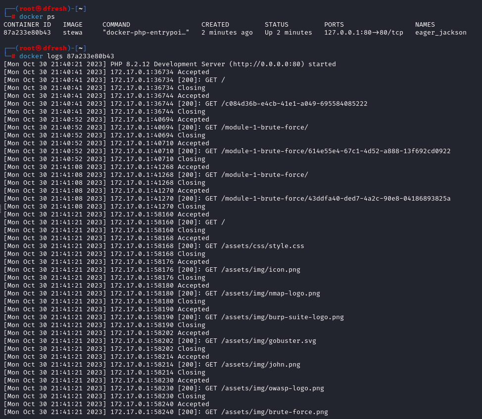
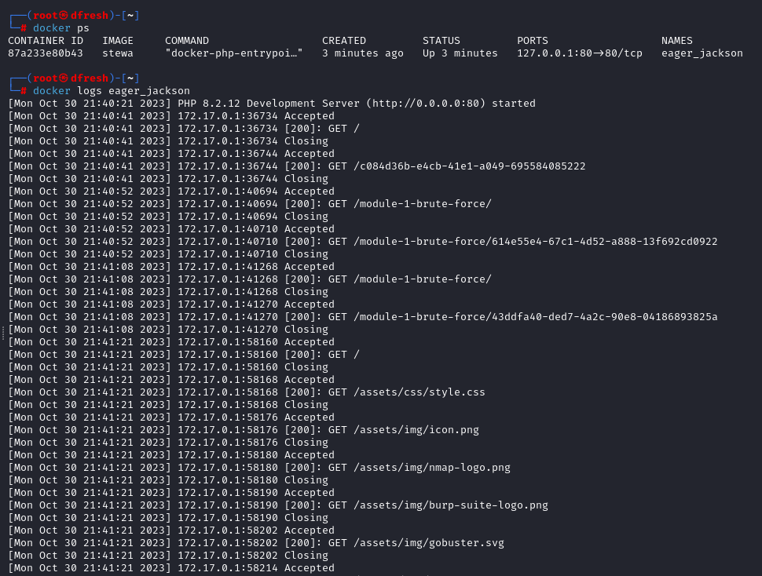

# Docker Logs

To redirect all of the logs into a `.json` file you need to **run a container with `--log-driver=json-file`** argument.

Additionally, you can specify how big the file can get with `--log-opt max-size=100m` and how many files the container can maximally produce with `--log-opt max-file=3`.

## Inspect Saved Logs

To inspect the logs you have two options:

1. Execute `docker logs [NUMBER ASSIGNED TO CONTAINER]` command.
2. Search for the `.json` files in `/var/lib/docker/containers/[NUMBER ASSIGNED TO CONTAINER]/*.json`.

In the `[NUMBER ASSIGNED TO CONTAINER]` field you can put **long container ID**, **short container ID** or **randomly generated name**.

## Example

Short Container ID:

Long Container ID:

Randomly generated name of Container:

Reading `.json.` file with logs:

## Example Log File

We've attached an example of a [generated log file](./../assets/files/eager_jackson-json.log) which has 666 log lines. It mostly containes records generated from directory brute forcing.